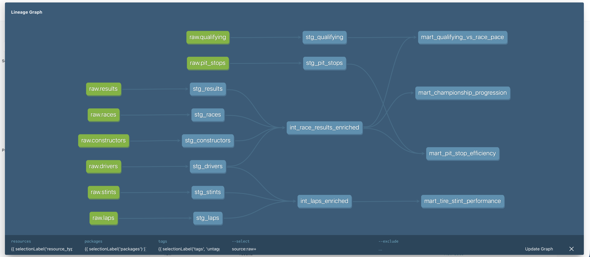

# 🏎️ F1 Race Strategy & Performance Analytics Platform

An end-to-end data engineering project that ingests Formula 1 race and telemetry
data, orchestrates it through Airflow, transforms it into an analytics-ready
warehouse with dbt on Snowflake, tests it automatically with CI, and serves it
through a live public dashboard.

**Live dashboard:** https://f1-analytics-platform-s2.streamlit.app

## Stack

Python · Apache Airflow · Docker · Snowflake · dbt · GitHub Actions · Streamlit

## Data sources

- **[Jolpica-F1](https://api.jolpi.ca/ergast/f1/)** — the actively-maintained Ergast-compatible successor API. Provides race results, qualifying, pit stops, drivers, and constructors.
- **[FastF1](https://docs.fastf1.dev/)** — official F1 timing data (the same data broadcasters use). Provides lap-by-lap timing and tire stint data.

## What's in the warehouse

**Staging** (`models/staging/`) — one model per raw entity, cleaned and typed:
`stg_races`, `stg_results`, `stg_qualifying`, `stg_pit_stops`, `stg_drivers`,
`stg_constructors`, `stg_laps`, `stg_stints`.

**Intermediate** (`models/intermediate/`):
- `int_race_results_enriched` — race results joined with driver, constructor, and race metadata
- `int_laps_enriched` — lap timing joined with driver name and tire stint

**Marts** (`models/marts/`):
- `mart_qualifying_vs_race_pace` — grid position vs. finish position per driver per race
- `mart_tire_stint_performance` — lap time and degradation per tire compound
- `mart_pit_stop_efficiency` — pit stop duration vs. final race outcome
- `mart_championship_progression` — cumulative championship points per driver per season

## Project structure

```
f1-analytics-platform/
├── ingestion/              # API clients + Snowflake loader
├── airflow/                # Dockerized Airflow: Dockerfile, docker-compose, DAG
├── dbt_project/            # dbt models: staging, intermediate, marts
├── dashboard/              # Streamlit app
├── snowflake_setup/        # One-time Snowflake provisioning SQL
├── .github/workflows/      # CI: runs dbt build on every push
├── test_ingestion.py       # Local smoke test for ingestion
└── requirements.txt        # Dashboard dependencies (for Streamlit Cloud)
```

## Setup — running this yourself

### 1. Snowflake
Run `snowflake_setup/setup.sql` in a Snowflake Workspace SQL File. This
provisions the warehouse, database, schemas, role, and raw tables. Replace
`<your_username>` in the `GRANT ROLE` statement with your actual username.

### 2. Local environment
```bash
git clone https://github.com/Pulkit9918/f1-analytics-platform.git
cd f1-analytics-platform
python3 -m venv venv
source venv/bin/activate
pip install requests pandas fastf1 "snowflake-connector-python[pandas]" dbt-snowflake
```

Set your Snowflake credentials as environment variables:
```bash
export SNOWFLAKE_ACCOUNT="your_org-your_account"
export SNOWFLAKE_USER="your_username"
export SNOWFLAKE_PASSWORD="your_password"
```

### 3. Test ingestion
```bash
python3 test_ingestion.py
```
This loads one round's worth of data into Snowflake's `RAW` schema. Confirm
in Snowsight that `F1_DB.RAW.RESULTS` etc. have rows before continuing.

### 4. Run dbt
```bash
cd dbt_project
dbt init f1_dbt  
dbt run
dbt test
```

### 5. Airflow (optional — for orchestrated/scheduled ingestion)
```bash
cd airflow
docker compose up airflow-init
docker compose up -d
```
Open `http://localhost:8080` (login `airflow`/`airflow`), unpause and trigger
`f1_ingestion_dag`.

### 6. Dashboard
```bash
cd dashboard
mkdir -p .streamlit
streamlit run app.py
```

## CI

Every push touching `dbt_project/` triggers `.github/workflows/dbt_ci.yml`,
which runs `dbt build` (models + tests) against Snowflake in a clean
environment. Requires `SNOWFLAKE_ACCOUNT`, `SNOWFLAKE_USER`, and
`SNOWFLAKE_PASSWORD` set as GitHub repo secrets.

## Lineage

